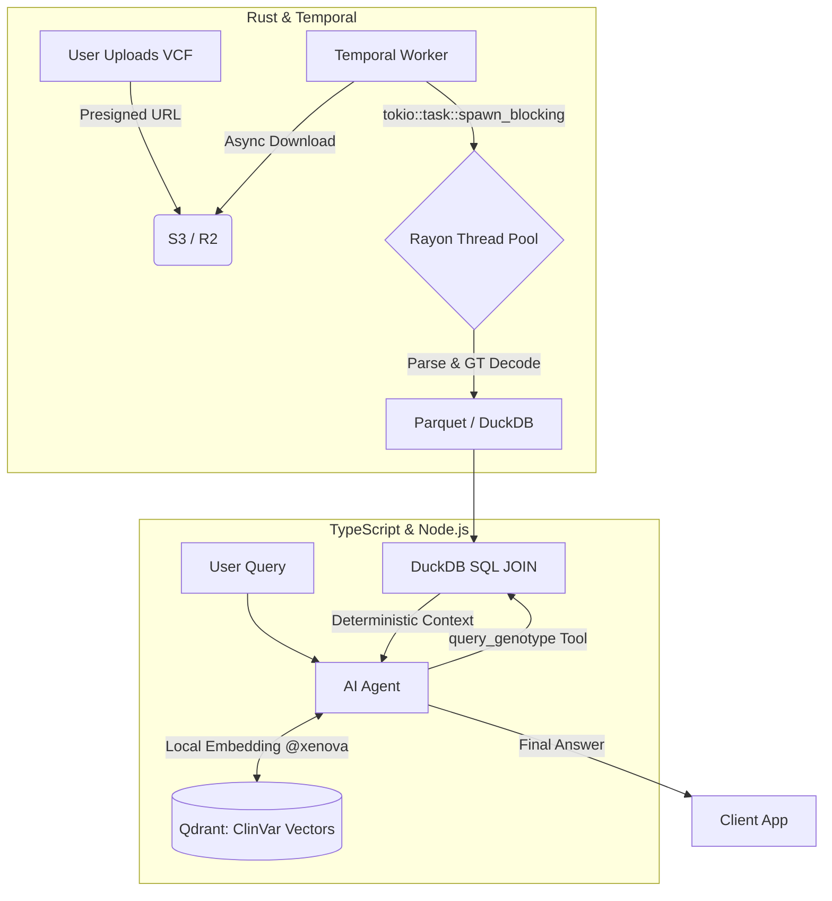

# SPEC.md: Genomic VCF Ingestion & AI Insight Engine

## 1. ARCHITECTURE OVERVIEW & DIAGRAMS

Система разделена на два независимых контура: **Data Ingestion Pipeline** (Rust + Temporal) для высокопроизводительной загрузки геномов и **RAG API Layer** (Node.js) для обслуживания AI-агента.



---

## 2. DATA MODELS & SYNTHESIS LOGIC

### 2.1. Схемы данных

Обеспечивается строгая совместимость с геномной сборкой **GRCh38**.

**Таблица `user_variants` (DuckDB/Parquet):**

* `chrom` (VARCHAR)
* `pos` (UINTEGER)
* `rsid` (VARCHAR) - Primary Join Key
* `ref` (VARCHAR)
* `alt` (VARCHAR)
* `gt_raw` (VARCHAR)

**Таблица `clinvar_annotations` (DuckDB):**

* `rsid` (VARCHAR) - Primary Join Key
* `gene` (VARCHAR)
* `phenotype` (VARCHAR)
* `clinical_significance` (VARCHAR)
* `evidence_note` (VARCHAR)

### 2.2. Genotype Decoding Engine

Логика преобразования индексов VCF (`GT`) в физические аллели пациента:

| VCF `GT` | Тип мутации | Итоговый `user_genotype` |
| --- | --- | --- |
| `0/0` или `0 | 0` | Гомозигота (Референс) |
| `0/1` или `1/0` | Гетерозигота | `REF / ALT` |
| `1/1` или `1 | 1` | Гомозигота (Мутация) |

### 2.3. Синтезирующий SQL JOIN (Tool Execution)

```sql
SELECT 
    v.rsid, c.gene,
    CASE 
        WHEN v.gt_raw LIKE '%0/0%' THEN v.ref || '/' || v.ref
        WHEN v.gt_raw LIKE '%0/1%' OR v.gt_raw LIKE '%1/0%' THEN v.ref || '/' || v.alt
        WHEN v.gt_raw LIKE '%1/1%' THEN v.alt || '/' || v.alt
        ELSE v.gt_raw
    END AS user_genotype,
    c.phenotype, c.clinical_significance, c.evidence_note
FROM user_variants v
JOIN clinvar_annotations c ON v.rsid = c.rsid
WHERE (c.gene = $1 OR c.rsid = $2)
  AND c.clinical_significance IN ('Pathogenic', 'Likely Pathogenic', 'Risk Factor');
```

---

## 3. RUST INGESTION WORKER SPECIFICATION

Имплементация паттерна *Hybrid Parallelism* (Асинхронный I/O + Синхронный CPU-пул) с трансляцией прогресса в Temporal.

```rust
use std::sync::atomic::{AtomicUsize, Ordering};
use std::sync::Arc;
use rayon::prelude::*;
use temporal_sdk::ActivityContext;
use tokio::time::{sleep, Duration};

#[derive(serde::Serialize)]
struct ProgressPayload {
    stage: String,
    processed: usize,
    total: usize,
    percentage: String,
}

pub async fn parse_and_index_activity(
    ctx: ActivityContext,
    vcf_lines: Vec<String>,
) -> Result<(), ActivityError> {
    let total = vcf_lines.len();
    let counter = Arc::new(AtomicUsize::new(0));
    let counter_for_rayon = Arc::clone(&counter);

    // CPU-bound блок (Rayon)
    let parse_task = tokio::task::spawn_blocking(move || {
        vcf_lines.into_par_iter().for_each(|line| {
            // Парсинг и сохранение
            // ...
            counter_for_rayon.fetch_add(1, Ordering::Relaxed);
        });
    });

    // I/O-bound блок (Temporal Heartbeat)
    let heartbeat_task = async {
        loop {
            sleep(Duration::from_millis(500)).await;
            let current = counter.load(Ordering::Relaxed);
            let percentage = (current as f64 / total as f64) * 100.0;
            
            ctx.heartbeat(ProgressPayload {
                stage: "RAYON_PARSING".into(),
                processed: current,
                total,
                percentage: format!("{:.1}%", percentage),
            });
            if current >= total { break; }
        }
    };

    let (parse_res, _) = tokio::join!(parse_task, heartbeat_task);
    parse_res.map_err(|e| ActivityError::from(e))?;
    Ok(())
}
```

---

## 4. TEMPORAL WORKFLOW SPECIFICATION

### Workflow Interface (TypeScript)

```typescript
import { proxyActivities, sleep } from '@temporalio/workflow';
import type * as activities from './activities';

const { downloadVcf, parseAndIndexVcf, validateDataset } = proxyActivities<typeof activities>({
  startToCloseTimeout: '10 minutes',
  heartbeatTimeout: '10 seconds', // Критично для отслеживания падений Rayon
  retry: {
    initialInterval: '2 seconds',
    maximumInterval: '1 minute',
    maximumAttempts: 3,
    nonRetryableErrorTypes: ['InvalidVcfFormatError'],
  },
});

export async function GenomicIngestionWorkflow(userId: string, fileKey: string): Promise<void> {
  const localFilePath = await downloadVcf(fileKey);
  await parseAndIndexVcf(userId, localFilePath);
  await validateDataset(userId);
}
```

---

## 5. AI AGENT & RAG SPECIFICATION

### 5.1. System Prompt

```text
You are an expert bioinformatics AI assistant. 
Your primary directive is accuracy. You must NOT invent or hallucinate genetic variants.
To answer any question regarding the user's genetics, you MUST call the `query_genotype` tool.
Use the tool's deterministic response to formulate a clear, scientifically accurate answer.
```

### 5.2. Tool Definition (Zod Schema)

```typescript
import { z } from 'zod';

export const queryGenotypeTool = {
  description: 'Queries the user genomic DuckDB database for specific genes or rsIDs.',
  parameters: z.object({
    targetId: z.string().describe('The gene symbol (e.g. CYP1A2) or rsID (e.g. rs762551) to query.'),
  }),
  execute: async ({ targetId }) => {
    return await duckDbRepository.synthesizeVariant(targetId);
  },
};
```

### 5.3. Local Embeddings Configuration

Используется `@xenova/transformers` (внутри процесса Node.js) для векторизации базы знаний без API-затрат.

* **Модель:** `Xenova/bge-small-en-v1.5`
* **Размерность вектора:** 384
* **Пул:** Mean Pooling + Normalization.

---

## 6. REPOSITORY STRUCTURE & INTERFACES

Проект строится по принципам Hexagonal Architecture (Ports & Adapters).

```text
├── rust-worker/                  # Temporal Worker (Rust)
│   ├── src/
│   │   ├── activities/           # Temporal Activities (Rayon + Tokio)
│   │   └── models/               # VCF Structs
├── ts-api/                       # Web API & AI Layer (TypeScript)
│   ├── src/
│   │   ├── domain/               # Core entities (Genotype, Annotation)
│   │   ├── application/          # Use cases, Agent Workflows, Temporal Client
│   │   ├── infrastructure/       
│   │   │   ├── ai/               # Vercel AI SDK, Tool definitions
│   │   │   ├── database/         # DuckDB Adapter
│   │   │   └── vector/           # Qdrant Adapter + @xenova local embeddings
│   │   └── interfaces/           # Express/Hono HTTP Controllers
├── docker-compose.yml            # Temporal, MinIO, Qdrant, API
└── SPEC.md
```

---

## 7. MOCK DATA & IMPLEMENTATION ROADMAP

### 7.1. Mock-файлы для детерминированного тестирования

Размещаются в `/tests/fixtures/`.

**`demo_user.vcf`:**

```vcf
##fileformat=VCFv4.2
##source=SyntheticGenomicsTest
#CHROM	POS	ID	REF	ALT	QUAL	FILTER	INFO	FORMAT	DEMO_USER
15	74749576	rs762551	A	C	99	PASS	GENE=CYP1A2	GT	1/1
2	135851076	rs4988235	C	T	99	PASS	GENE=LCT	GT	0/0
12	21282148	rs4149056	T	C	99	PASS	GENE=SLCO1B1	GT	0/1
```

**`annotations_mock.tsv`:**

```tsv
rsid	gene	phenotype	clinical_significance	evidence_note
rs762551	CYP1A2	Slow caffeine metabolizer	Risk Factor	Decreased CYP1A2 enzyme activity.
rs4988235	LCT	Primary Lactase Deficiency	Pathogenic	Absence of lactase persistence allele.
rs4149056	SLCO1B1	Statins myopathy risk	Risk Factor	Intermediate OATP1B1 function.
```

### 7.2. Step-by-Step Roadmap

1. **Local DuckDB Prototyping:** Написать скрипт, загружающий 2 mock-файла в In-Memory DuckDB, и проверить выполнение JOIN-запроса.
2. **Infrastructure Setup:** Написать `docker-compose.yml` (Temporal Server, Qdrant, MinIO).
3. **Rust Worker Implementation:** Реализовать `tokio`+`rayon` пайплайн для парсинга VCF и отправки прогресса через `ctx.heartbeat`.
4. **TypeScript RAG & Agent:** Реализовать локальный эндинг (`@xenova/transformers`) и AI-агента с тулом `query_genotype`.
5. **E2E Testing:** Запустить интеграционный тест, проверяющий, что на вопрос "Can I drink coffee?" агент извлекает `C/C` для `rs762551` и даёт детерминированный ответ.
